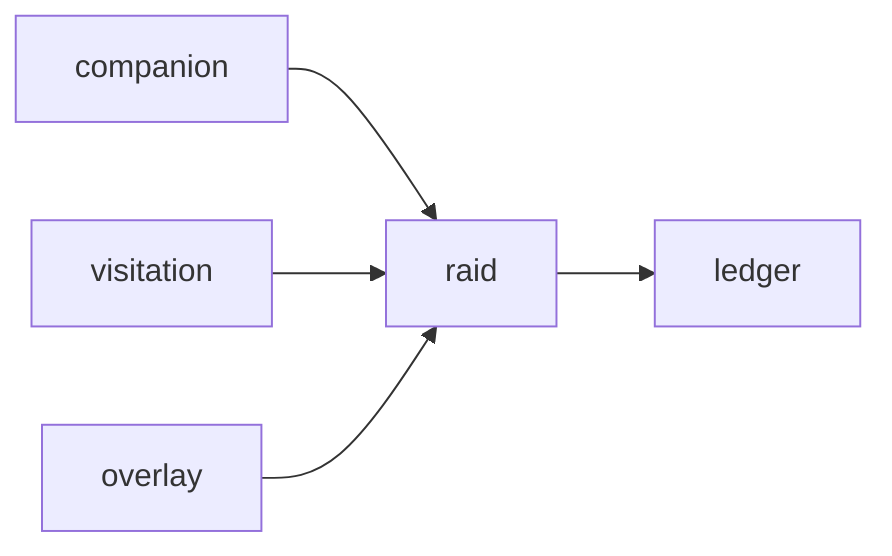

# Raid

**Pet Boss Raids** — Co-op raid bosses that need a crowd of pets in the same encounter.

Part of [ComputerPets](https://github.com/RicheyWorks/computerpets). Map: [computerpets-ecosystem](https://github.com/RicheyWorks/computerpets-ecosystem).

| | |
| --- | --- |
| Status | Design scaffold — loop and engine frozen |
| License | MIT |
| Tokens | Minigames never mint or burn. Tired overlay, not a dead lineage. |
| First pet | [Meet Rui first](https://github.com/RicheyWorks/computerpets/blob/main/docs/START-HERE.md). This game is optional. |

## The loop

One Rui cannot punch a weekly titan. Raid is the MMO slice: Visitation presence + WebSockets. Damage is care-stat scaled. Loot is shared cosmetics.

## Who plays

Groups. One pet per player plus kennel supports.

## What it is not

A 10k MMO. Cap is dozens. Stampede tests the wire, not this encounter.

## Genre and engine

- Genre: **Co-op raid**
- Engine: **Spring WebSockets**
- Stack: Java 21 · Spring Boot 3.3 · STOMP fights · dozens of pets · Companion + Overlay clients
- Default surface: `8096`

## Architecture



## How you play

1. Schedule a raid window.
2. Bring 12–40 pets (one per player, or kennel support NPCs).
3. Phases. Wipe = all tired, nobody burned.
4. Loot via Ledger, bind-on-pickup cosmetics.

## First slice

Build this and stop.

**One dummy titan, 12 pets, wipe = all tired, cosmetic loot bind-on-pickup.**

You know it works when: Desync pauses the boss. Cheat damage kicks + Forensics. Nobody is burned.

## Environment

JDK 21

## Failure doctrine

Desync → boss pauses. Stampede-tested to 10k presence, raid cap is lower on purpose. Cheat damage → kick, log Forensics.

Canon rules that never yield:

- 210 living kinds. No illegal hybrids.
- Overlay pets can get tired, sick, or hide. Tokens are not burned by a minigame.
- Desktop walk stays the main quest. Closing Raid must leave Rui walking.

## Neighbors

- computerpets-visitation
- computerpets-companion
- computerpets-overlay
- computerpets-ledger
- computerpets-stampede (load)

## Layout

```
computerpets-raid/
  README.md
  LICENSE
  docs/DESIGN.md
  src/                implementation lands here
```

## Run (Windows)

```powershell
mvn -q -DskipTests package; java -jar target/raid-1.0.0-SNAPSHOT.jar
```

Meet Rui first via the [flagship start-here](https://github.com/RicheyWorks/computerpets/blob/main/docs/START-HERE.md). This game is optional.

## Links

- Flagship: [RicheyWorks/computerpets](https://github.com/RicheyWorks/computerpets)
- This repo: [RicheyWorks/computerpets-raid](https://github.com/RicheyWorks/computerpets-raid)
- Map: [RicheyWorks/computerpets-ecosystem](https://github.com/RicheyWorks/computerpets-ecosystem)
- Design file: [docs/DESIGN.md](docs/DESIGN.md)

## License

MIT. See [LICENSE](LICENSE).

---

*Two hundred ten living kinds. Keep them so a line does not go quiet.*
